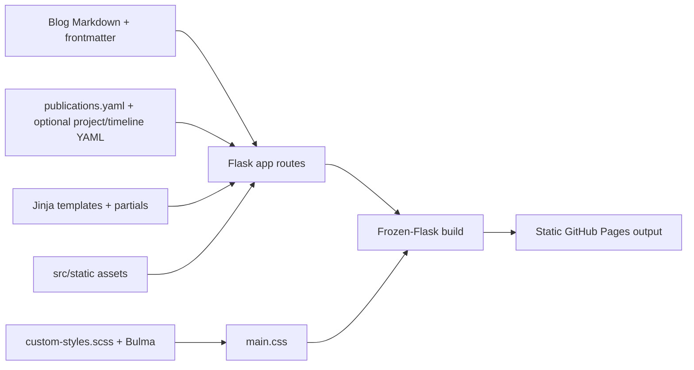

# Raluca Portfolio — Engineering Design Doc

**Author:** Codex
**Status:** Draft v0.1
**Last updated:** 2026-06-04
**Reviewers:** TBD

---

## 1. Summary

We are redesigning an existing Flask/Jinja personal portfolio that is built into a static GitHub Pages site with Frozen-Flask. The architecture should stay deliberately boring: Jinja templates for page structure, Markdown/frontmatter for blog posts, YAML for publications, static assets under `src/static`, and SCSS compiled through the existing Bulma pipeline. The most important engineering choice is to introduce a stronger site-specific content/design layer without migrating frameworks or making the site harder to maintain.

## 2. Assumptions

- **Target scale:** Static personal portfolio traffic, comfortably handled by GitHub Pages/CDN.
- **Latency budget:** First meaningful content should render quickly on normal mobile networks; no client-side app boot should be required.
- **Platform:** Responsive web, generated from the current Flask/Jinja/Frozen-Flask project.
- **Cost ceiling:** $0/month hosting beyond domain costs; no paid APIs or runtime services in v1.
- **Out of scope:** Framework migration, CMS, auth, contact form backend, analytics dashboard, image generation, search backend, and dynamic project APIs.

## 3. Goals & non-goals

**Goals (v1):**
- Preserve the current Flask/Jinja/Frozen-Flask publishing model.
- Redesign the homepage around profile, contact details, featured projects, timeline, and recent writing.
- Add maintainable structured project/timeline content, either in lightweight YAML or clearly isolated template data.
- Rework visual styling through `custom-styles.scss` and the existing `npm run build-bulma` pipeline.
- Keep pages responsive, accessible, readable, and static-host friendly.
- Keep the static build deterministic: same content in, same generated pages out.

**Non-goals (v1):**
- No migration to React, Next.js, Astro, Hugo, or another static site generator.
- No backend service beyond local Flask during development/build.
- No database or CMS.
- No contact form submission handling.
- No JavaScript-heavy animations or client-side routing.
- No visual regression or end-to-end browser automation test suite in v1.

## 4. Architecture



The system remains a static site generator implemented in Python. Flask provides local rendering and route definitions; Frozen-Flask materializes those routes into static files; Sass/Bulma provides the compiled CSS bundle.

**What's here:**
- Flask app — route definitions, content loading, filters, and template rendering.
- Jinja templates — homepage, blog, resume, publications, and reusable partials.
- Markdown/frontmatter parser — blog metadata and rendered blog content.
- YAML data files — publications today; candidate home/project/timeline data later if useful.
- SCSS build — Bulma plus site-specific design rules.

**What's deliberately NOT here:**
- No client-side app framework — unnecessary for a static portfolio.
- No server database — content is local files committed to the repo.
- No API layer — pages are generated at build time.
- No queue, cache, or worker — there is no runtime workload.
- No design-token package — `custom-styles.scss` is sufficient for v1.

## 5. Key components

### Flask content app

- **Responsibility:** Load content files, prepare template data, define routes, and render pages locally/build-time.
- **Tech choice:** Existing Flask app in `src/app.py`.
- **Why this choice:** It already works and fits a small static portfolio.
- **Interface:** `index()`, `blogList()`, `render_blog_page(page_name)`, `render_page(page_name)`, `publications()`, `search_tag(tag)`.

### Blog content pipeline

- **Responsibility:** Discover Markdown posts, parse frontmatter, render Markdown to HTML, sort posts, and filter by tag.
- **Tech choice:** Existing `python-frontmatter`, `markdown`, and `BulmaImageExtension`.
- **Why this choice:** The current posts already use this format; keeping it avoids a migration.
- **Interface:** `list_blog_files()`, `get_blog_info(file)`, `list_all_blog_info()`, `filter_blog_posts_by_tag(tag)`.

### Homepage content model

- **Responsibility:** Provide structured profile, contact, featured project, timeline, and tag data to the homepage.
- **Tech choice:** Prefer a new lightweight YAML file such as `src/data/home.yaml` if entries grow beyond a few hardcoded items.
- **Why this choice:** YAML matches existing `publications.yaml` and keeps content edits out of large templates.
- **Interface:** `load_yaml_data("home.yaml")` or equivalent helper returning dictionaries for template use.

### Jinja template layer

- **Responsibility:** Render semantic HTML for homepage, blog cards, publications, resume timeline, and footer.
- **Tech choice:** Existing Jinja templates and partials.
- **Why this choice:** The page count is small and template reuse is enough.
- **Interface:** Template blocks in `base.jinja`; partials such as `_blogList.jinja`, `_footer.jinja`, and new project/timeline partials if needed.

### Styling pipeline

- **Responsibility:** Define the green theme, warm accents, typography, cards/lists, timeline, focus states, and responsive behavior.
- **Tech choice:** Existing Sass + Bulma compile command.
- **Why this choice:** Bulma is already installed; a custom layer can override the default look without replacing the stack.
- **Interface:** `custom-styles.scss`, `my-bulma-project.scss`, compiled by `npm run build-bulma` into `src/static/css/main.css`.
- **Theme token source:** Add the Lovable Theme: Fresh Greens `:root` and `.dark` token blocks from `BRIEF.md` to `custom-styles.scss`. Existing local color variables should be replaced or mapped to `hsl(var(--primary))`, `hsl(var(--card))`, `hsl(var(--foreground))`, and related token references, but body/html/page backgrounds must remain white rather than using the green `--background` token.

### Static build

- **Responsibility:** Freeze the Flask-rendered routes to static output for GitHub Pages.
- **Tech choice:** Existing Frozen-Flask setup in `freeze.py`.
- **Why this choice:** It is appropriate for a personal site with file-based content.
- **Interface:** `python freeze.py`.

## 6. Data model

Existing blog post frontmatter:

```yaml
title: "Post title"
subtitle: "Short subtitle"
date: 2025-04-18
cover-img: "img/example.png"
thumbnail-img: "img/example-thumb.png"
tags:
  - Computer Vision
  - PyTorch
```

Candidate homepage data:

```yaml
profile:
  name: "Raluca-Maria Sandu"
  location: "Zurich, Switzerland"
  summary: "AI/ML engineer and researcher focused on computer vision, multimodal systems, medical imaging, and practical generative AI."
  email: "rmsan@duck.com"
  github: "https://github.com/rmsandu"
  linkedin: "https://linkedin.com/in/rmsandu"
  scholar: "https://scholar.google.com/citations?user=5qskcz0AAAAJ"

projects:
  - title: "Wrinkle segmentation"
    problem: "Detect and segment facial wrinkle patterns from images."
    built: "Computer vision pipeline with segmentation/evaluation outputs."
    stack: ["Python", "PyTorch", "Computer Vision"]
    link: "blog/2025-04-18-wrinkle-segmentation.html"
    accent: "coral"

timeline:
  - date: "2022-present"
    icon: "briefcase"
    title: "AI/ML engineering and consulting"
    summary: "Built applied AI systems across generative AI, computer vision, and cloud workflows."
```

**Notes:**
- Project and timeline entries can start as YAML to keep templates readable.
- Links should remain relative Flask routes where possible.
- No visitor PII is collected in v1.
- Existing blog content remains the source of truth for long-form project/writeup pages.

## 7. API surface

This site has no runtime network API. The relevant internal call graph is:

### `list_blog_files()`

- **Input:** None; reads `BLOG_DIR`.
- **Output:** List of Markdown file paths ending in `.md`.
- **Errors:** Missing directory should fail loudly in development/build.
- **Latency budget:** Build-time/local only; should remain trivial for current post volume.

### `get_blog_info(file)`

- **Input:** Path to a Markdown blog post.
- **Output:** Dict with `title`, `subtitle`, `date`, rendered `content`, images, tags, and filename.
- **Errors:** Malformed frontmatter or Markdown should fail during development/build, not silently render broken content.
- **Latency budget:** Build-time/local only.

### `list_all_blog_info()`

- **Input:** None.
- **Output:** Blog info list sorted by descending date.
- **Errors:** Invalid dates should be handled deliberately; current code assumes date-like values for sorting.
- **Latency budget:** Build-time/local only.

### `filter_blog_posts_by_tag(tag)`

- **Input:** Tag string from route.
- **Output:** Blog posts where the tag appears in the post's `tags`.
- **Errors:** Unknown tags return an empty list.
- **Latency budget:** Build-time/local only.

### `format_date(value, format="%B %d, %Y")`

- **Input:** Date/datetime or `None`.
- **Output:** Human-readable date string or `"No Date"`.
- **Errors:** Non-date values should be caught in tests if supported later.
- **Latency budget:** Render-time only; negligible.

## 8. Key trade-offs (with rejected alternatives)

### Decision: Keep Flask/Jinja/Frozen-Flask

- **Chose:** Keep the current stack.
- **Considered:** Migrating to a modern static framework.
- **Considered:** Rebuilding as a client-side app.
- **Why we picked this:** The site is small and content-driven. A migration would spend effort on tooling instead of improving the portfolio's actual communication and design.

### Decision: Add structured YAML only where it reduces template clutter

- **Chose:** Keep blog/publication patterns and optionally add `home.yaml` for projects/timeline.
- **Considered:** Hardcoding all homepage entries in `home.html`.
- **Considered:** Creating a full content schema/CMS.
- **Why we picked this:** YAML is already used for publications and is easy to edit. A CMS is far beyond v1; hardcoding may become messy once project and timeline entries grow.

### Decision: Use existing Font Awesome icons

- **Chose:** Reuse the icon library already loaded in `base.jinja`.
- **Considered:** Adding lucide or another icon package.
- **Considered:** Hand-drawn SVG icons.
- **Why we picked this:** The brief wants icon/timeline inspiration, but adding another dependency is unnecessary if Font Awesome covers contact and timeline symbols.

### Decision: Redesign image usage instead of adding heavy visual effects

- **Chose:** Stable thumbnails, solid text surfaces, and theme placeholders.
- **Considered:** Text-over-image cards with shadows.
- **Considered:** Animated hero/media effects.
- **Why we picked this:** The current overlay style hurts readability. The new design should feel polished through hierarchy and content, not through fragile image treatments.

## 9. Risks & unknowns

- **Project content quality** — Likelihood: medium — Mitigation: write project cards as practical case studies with problem/build/stack/link, not generic blog teasers.
- **CSS specificity fights with Bulma** — Likelihood: medium — Mitigation: keep custom classes namespaced and compile through the existing Sass entrypoint.
- **Homepage becomes too dense** — Likelihood: medium — Mitigation: cap featured projects at 4-6 and move overflow to writing/archive pages.
- **Broken static routes after changing links** — Likelihood: medium — Mitigation: verify Flask routes locally and run Frozen-Flask build before publishing.
- **Image layout shifts or missing assets** — Likelihood: medium — Mitigation: define stable image dimensions and fallback placeholders.
- **Date sorting errors from malformed frontmatter** — Likelihood: low — Mitigation: add unit tests for blog parsing/sorting and fail clearly during build.

## 10. Testing strategy

**Unit tests (must have):**
- `list_blog_files()` — returns only `.md` files from `BLOG_DIR` and ignores the template file if the implementation chooses to exclude it.
- `get_blog_info(file)` — parses frontmatter fields, renders Markdown content, derives `filename`, and applies `BulmaImageExtension` image classes/URLs inside a Flask request context.
- `list_all_blog_info()` — sorts posts by descending `date` and preserves required metadata fields.
- `filter_blog_posts_by_tag(tag)` — returns only posts whose `tags` include the selected tag and returns an empty list for unknown tags.
- `format_date(value)` — formats a normal date and returns `"No Date"` for `None`.
- `BulmaImageProcessor.handleMatch()` — converts Markdown image syntax into a `figure.image` containing an `img.blog-image` with static URL and alt text.
- Proposed `load_yaml_data(filename)` helper, if added — loads valid YAML from `src/data`, returns dictionaries/lists, and raises a useful error for missing or malformed files.

**Integration tests (one per major flow):**
- Homepage render flow — Flask test client `GET /` returns 200 and includes Raluca's name, email, GitHub link, at least one featured project title, and timeline marker text.
- Blog list flow — `GET /blogList.html` returns 200 and includes recent post titles sorted newest first.
- Blog tag filter flow — `GET /search/blogList/<tag>.html` returns 200, includes matching posts, and does not include an unrelated post fixture.
- Blog post flow — `GET /blog/<slug>.html` returns 200 and includes the rendered title, formatted date, tags, and Markdown-rendered content.
- Publications flow — `GET /publications.html` returns 200 and includes publication titles from `publications.yaml`.
- Resume flow — `GET /resume.html` returns 200 and includes the CV PDF link and key timeline role headings.
- Static freeze flow — invoking the Frozen-Flask build in a temporary output directory produces `index.html`, `blogList.html`, `publications.html`, `resume.html`, and at least one generated blog post page.

**Deliberately not tested (and why):**
- Exact visual styling, colors, hover motion, and timeline icon aesthetics — these are better verified manually with browser screenshots because CSS snapshot tests are brittle here.
- Third-party CDN availability for Font Awesome — outside the repo's control; local fallback can be considered later if needed.
- Browser-specific rendering differences — v1 manual QA in desktop/mobile viewports is enough.
- External links resolving successfully — links should be present and syntactically correct, but external site uptime is not this test suite's job.
- PDF binary content — test that the CV link/path exists, not the PDF internals.
- Generated static HTML byte-for-byte snapshots — too noisy for a design iteration; assert key content and generated paths instead.

**Stack defaults:**
- Python tests use `pytest`.
- Flask route tests use `app.test_client()`.
- Build tests can use `tmp_path` and Frozen-Flask configuration overrides.
- No Playwright, Cypress, or visual regression framework in v1.

## 11. Rollout & monitoring

- **Rollout:** Develop locally, verify responsive pages, freeze the site, then publish through the existing GitHub Pages flow.
- **Feature flags:** None; this is a static redesign.
- **Monitoring:** Manual checks after deploy: homepage loads, contact links are visible, project links work, blog/publication/resume routes render, and mobile navigation opens/closes.
- **Rollback plan:** Revert the redesign commit or restore the previous static build from git history.

## 12. Cost & capacity

- **Per-user cost:** $0 incremental runtime cost.
- **Monthly budget at v1 scale:** $0 hosting on GitHub Pages, assuming existing domain setup.
- **What breaks at 10x scale:** Nothing meaningful at normal portfolio traffic. The first bottleneck is maintainability of manually curated content, not hosting capacity; if that happens, add better YAML schemas or a lightweight content-generation script.

## 13. Open questions

- [ ] Which 4-6 projects are the canonical featured projects? — Raluca
- [ ] Should homepage project/timeline data live in YAML or directly in Jinja for v1? — Engineering
- [ ] Which portrait/avatar treatment should ship? — Raluca + UX
- [ ] Should Font Awesome remain CDN-loaded, or should icons be bundled locally? — Engineering

## 14. Out of scope (will not do)

- **No framework migration** — only revisit if content needs outgrow Flask/Jinja.
- **No CMS** — only revisit if non-technical editing becomes a requirement.
- **No contact form backend** — only revisit if direct email becomes insufficient.
- **No dynamic analytics dashboard** — this portfolio does not need runtime data collection for v1.
- **No automated visual regression suite** — only revisit if the site gains complex UI states.
- **No AI-generated asset pipeline** — only revisit if a custom visual identity requires generated bitmap assets.
